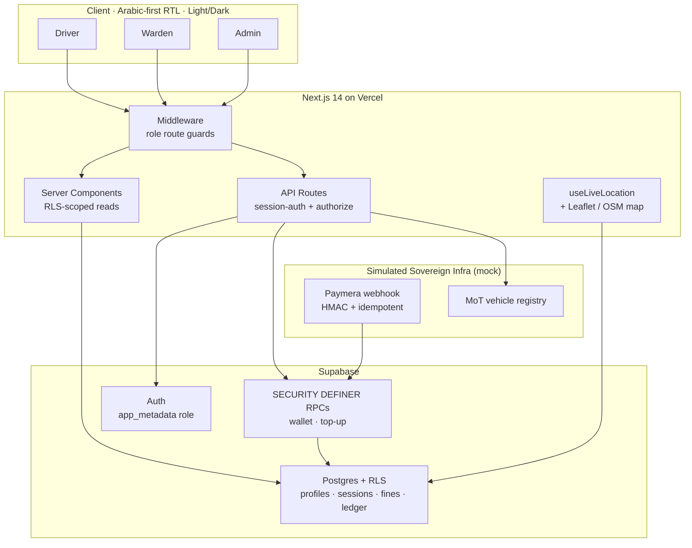
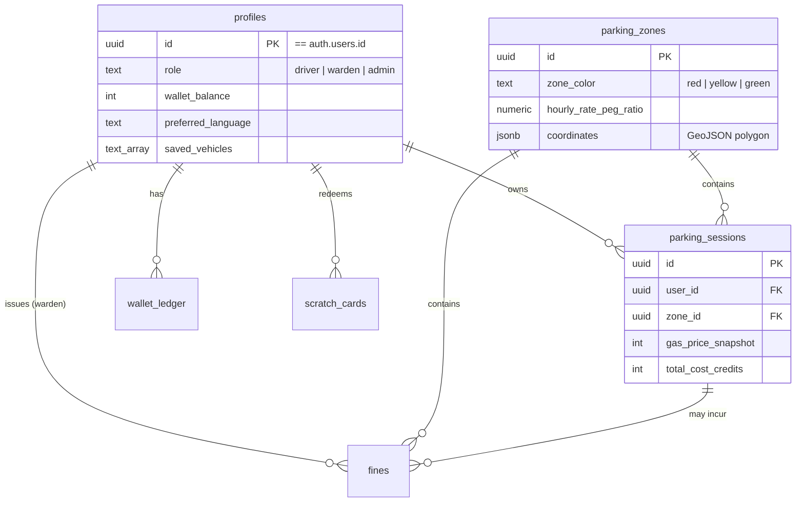

# Mawqif (موقف) — Damascus Smart Parking Platform

[](https://damascus-park.vercel.app)
[](https://nextjs.org/)
[](https://www.typescriptlang.org/)
[](https://supabase.com/)
[](https://tailwindcss.com/)
[](https://leafletjs.com/)
[](#-license)

> An **Arabic-first**, production-grade digital parking ecosystem built for the context of a phase‑1 municipal rollout in **Damascus, Syria** — with inflation-resilient pricing, role-based enforcement, and a prepaid wallet, all on a **$0 open-source stack**.

Inspired by EasyPark, Mawqif reimagines on-street parking for an economy where the currency is volatile, cash is king, and conventional payment/identity rails are unavailable. It pairs a hardened Supabase backend with a polished Next.js front end that is right-to-left native, theme-aware, and wired to live geolocation and an interactive map.

🔗 **Live:** [damascus-park.vercel.app](https://damascus-park.vercel.app) · **Demo accounts** are listed [below](#-live-demo).

---

## 🎯 Problem Statement

On-street parking in Damascus is almost entirely cash-based, with no real-time enforcement visibility and no digital record of revenue. Three structural problems make a naïve "tap-to-pay" clone unworkable:

1. **Hyperinflation.** A fixed tariff in Syrian Pounds (SYP) is meaningless within months. Pricing has to track *real* value, not a nominal number.
2. **Constrained payment rails.** Years of sanctions and a fragile banking sector mean international card networks and most fintech APIs are unavailable. Top-ups need to work via local rails (telecom wallets, prepaid vouchers, the nascent national payment network).
3. **No open civic data.** There is no public vehicle-registry API (see the [vehicle-data note](#-a-note-on-real-vehicle-data)), so enforcement tooling has to be designed around a future government data-sharing channel, not a self-serve API.

Mawqif addresses all three: parking fees are **pegged to a commodity index** so they inflate with the economy automatically; the wallet is **prepaid** and fed by vouchers and a (simulated) sovereign payment network; and external integrations sit behind a **swappable service layer** built for a private B2G endpoint.

---

## ✨ Key Features

### 💸 Commodity-Pegged Dynamic Pricing
The pricing engine ([`lib/pricing.ts`](lib/pricing.ts)) never stores a SYP tariff. Instead it computes:

```
hourly_rate (credits) = (gasoline_price_per_litre_SYP / 1000) × zone.peg_ratio
```

The gasoline price lives in a single `system_settings` row. When an **Admin** updates it, **every zone re-prices instantly** — the whole tariff schedule tracks inflation with one number, and historical sessions are billed against a per-session gas snapshot for fair, stable billing.

### 🔐 Role-Based Access Control (Driver / Warden / Admin)
- Identity is unified on a single `profiles` table (`id == auth.users.id`).
- The trusted role lives in **`app_metadata`** (not client-editable), enforced by Next.js **middleware route guards** and **row-level security** at the database.
- **Drivers** see only their own data; **Wardens** can check plates and issue fines; **Admins** get global telemetry.

### 🏦 Prepaid Wallet & Append-Only Ledger
- Top-ups via **scratch-card vouchers** and the simulated **Paymera** network.
- An append-only `wallet_ledger` that reconciles exactly — debits **reject on insufficient funds** rather than silently clamping, and the gas-charge on session-end returns `402` if the wallet can't cover it.

### 🛰️ Native Live Geolocation + Geofencing
- A custom [`useLiveLocation`](lib/hooks/useLiveLocation.ts) hook watches `navigator.geolocation`, gracefully falls back to the Damascus city center on permission-denied, and runs a **ray-casting point-in-polygon** test against the zones' GeoJSON.
- Standing inside a colored zone **pre-selects and "Suggests"** it in the start-parking flow.

### 🗺️ Interactive OpenStreetMap (Leaflet)
- A real, pannable [Leaflet](https://leafletjs.com/) map on **free OpenStreetMap tiles** (no paid keys), with the parking zones drawn as colored polygons, a live position marker, and a one-tap **"locate me"** control. Renders as a dark basemap in dark mode.

### 🌐 World-Class Arabic-First UX
- **Native RTL** (`dir="rtl"`, `lang="ar"`) using Tailwind **logical properties** (`ms-*`, `pe-*`, `text-start`) so the UI mirrors perfectly when toggled to English.
- **Light / Dark / System** theming via `next-themes`, built on CSS-variable color tokens.
- The Cairo typeface for seamless Arabic + Latin, and a personalization **Settings** page (display name, language, saved vehicles).

### 🏛️ Simulated Syrian Sovereign Infrastructure
- **Paymera webhook** ([`/api/webhooks/paymera`](app/api/webhooks/paymera/route.ts)) — HMAC-SHA256 verification, a replay window, and a database-level **idempotency guard** so a retried payment never double-credits.
- **Ministry of Transport vehicle registry** ([`lib/services/syrian-transport-api.ts`](lib/services/syrian-transport-api.ts)) — a typed mock with realistic latency and failure modes, behind an interface ready to swap for a real private endpoint.

---

## 🔒 Security Posture

Security was treated as a first-class deliverable. The live database is **Supabase-advisor-clean** apart from intentional/PostGIS notes:

- **Role-aware RLS on every table** — `profiles`, `parking_sessions`, `fines`, `wallet_ledger`, `scratch_cards`, `parking_zones`, `system_settings`.
- **Column-level locks** — a user JWT can never edit its own `role` or `wallet_balance`.
- **Privileged wallet RPCs are `SECURITY DEFINER` and service-role-only** — closing a hole where any anon caller could mint credits.
- **Recursion-safe policies** via an `auth_role()` helper; **non-self-assignable roles** (sourced from `app_metadata`, defaulted to `driver` at signup).
- **API routes derive identity from the verified session**, never the request body.

---

## 🛠️ Tech Stack & Architecture

| Layer | Technology |
|---|---|
| **Frontend** | Next.js 14 (App Router), React 18, TypeScript (strict), Tailwind CSS, `next-themes`, `lucide-react` |
| **Mapping & Geo** | Leaflet + react-leaflet, OpenStreetMap tiles, native Geolocation API |
| **Backend** | Supabase — Postgres + Row-Level Security, Auth, SECURITY DEFINER RPCs, PostGIS |
| **Localization** | Custom RTL-first i18n (ar/en), Cairo font, Tailwind logical properties |
| **Hosting / CI** | Vercel (GitHub-integrated continuous deployment) |
| **Tooling** | Strict `tsc`, `next build`, SQL migrations |

### System Architecture



### Core Data Model



---

## 🚀 Live Demo

**[damascus-park.vercel.app](https://damascus-park.vercel.app)** — sign in with any demo account (password `Demo@Mawqif2025!`):

| Role | Email | Try this |
|---|---|---|
| 🚗 **Driver** | `driver@mawqif.sy` | Top up with PIN `MAWQ-IFSY-2025` (+200), start/end a parking session, watch the live map. |
| 🛡️ **Warden** | `warden@mawqif.sy` | Check a plate (`ح ل 4455`) against the MoT registry and issue a fine. |
| 📊 **Admin** | `admin@mawqif.sy` | Change the gasoline price and watch every zone re-price live. |

> _This is a public demo environment with seeded data — treat it as a sandbox._

---

## 🧑‍💻 Getting Started (Local)

```bash
# 1. Install
npm install

# 2. Configure environment
cp .env.local.example .env.local   # then fill in your Supabase + Paymera values

# 3. Run migrations  (supabase/migrations/*.sql) against your project, then:
npm run dev                         # http://localhost:3000

# 4. Seed demo users + data
curl -X POST http://localhost:3000/api/seed
```

The app runs on built-in **mock data** when Supabase env vars are absent, so you can explore the UI with zero configuration.

### Required environment variables

```env
NEXT_PUBLIC_SUPABASE_URL=https://<project-ref>.supabase.co
NEXT_PUBLIC_SUPABASE_ANON_KEY=<publishable-anon-key>
SUPABASE_SERVICE_ROLE_KEY=<server-only-service-role-key>
PAYMERA_WEBHOOK_SECRET=<hmac-signing-secret>
```

---

## 🗂️ Project Structure

```
app/
  (auth)/login/            # Auth flow (server actions)
  (protected)/             # Role-guarded shell + driver / warden / admin / settings
  api/                     # sessions · fines · wallet · settings · seed · webhooks/paymera
components/
  views/                   # DriverView · WardenView · AdminView
  map/                     # LiveMap + LeafletMap (OSM, dynamic ssr:false)
  settings/  theme/  ui/   # Settings form, theme toggle, shared UI
lib/
  pricing.ts               # Commodity-pegged pricing engine
  hooks/useLiveLocation.ts # Native geolocation + point-in-polygon geofencing
  services/                # Simulated MoT vehicle-registry client
  supabase/  i18n/         # SSR/browser clients · RTL-first translations
supabase/migrations/       # 001–008 : schema, RLS, RPC hardening, idempotency, prefs
middleware.ts              # JWT-based role route guards
```

---

## 🧾 A Note on Real Vehicle Data

The MoT integration is intentionally a **mock**. As of 2026, Syria has **no public, developer-accessible vehicle-lookup API** comparable to Denmark's *Motorregisteret* or the UK's DVLA. The registry (held by the Interior Ministry's General Directorate of Traffic) is digitized on an internal central network and a national e-government portal is being built, but a real integration would require a **private B2G data-sharing agreement** — which is exactly why the service is isolated behind a swappable interface.

---

## 🛣️ Status & Roadmap

- ✅ Hardened Supabase backend (identity, RLS, idempotent payments) — deployed & verified
- ✅ Live dashboards wired to real data; theming, settings, geolocation, OSM map
- 🔜 Driver-side fine payment flow · realtime updates · server-side plate normalization
- 🔜 Real Paymera / MoT integration once a sovereign channel is available

> The **Paymera** payment network and **Ministry of Transport** registry are **simulated** enterprise mocks designed to be replaced by real endpoints without structural changes.

---

## 🙏 Acknowledgments

Built on the shoulders of open source — **Next.js**, **Supabase**, **Leaflet**, and the global **OpenStreetMap** community, whose free tiles make a $0-budget civic platform possible. The project is dedicated to the people of Damascus and to building accessible, inflation-resilient public infrastructure.

---

## 📄 License

Released under the **MIT License**. You are free to use, modify, and distribute this software with attribution.
